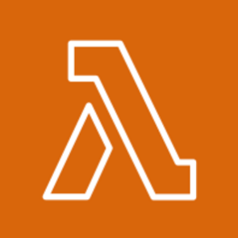
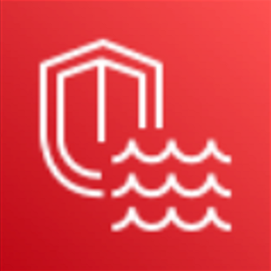

# AWS re:Invent 2022で気になったサービス

## 1. AWS Lambda SnapStart 

- 関数を事前に初期化(init)して実行環境のスナップショットを保存しておき、関数を初回実行する際には、予め保存したスナップショットを復元することで起動時間を短縮する。現在、Java 11のみ対応している。

## 2. Amazon Security Lake 
  - クラウド、オンプレミス、カスタムソースからのセキュリティログを集約・管理し、分析や利用のアクセスを提供するデータレイクサービスであり、AWS CloudTrail、AWS Security Hub等のログを収集する。

# 参考

- AWS Lambda SnapStart
  - https://aws.amazon.com/jp/blogs/news/new-accelerate-your-lambda-functions-with-lambda-snapstart/
- Lambda execution environment
  - https://docs.aws.amazon.com/lambda/latest/dg/lambda-runtime-environment.html
- Amazon Security Lake
  - https://aws.amazon.com/jp/security-lake/

